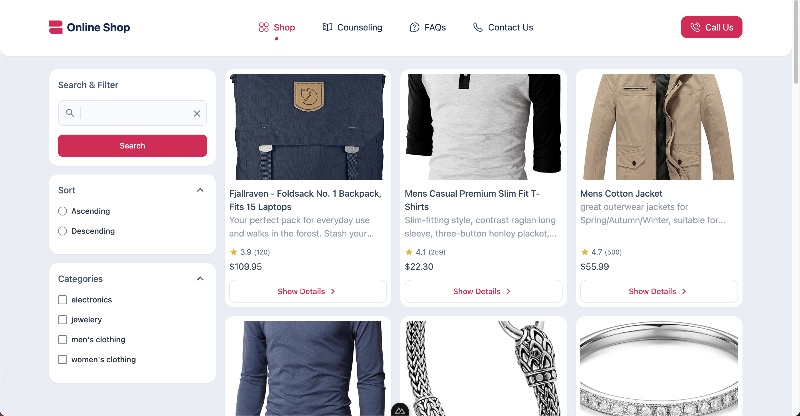

# Nuxt 3 Online Shop

This repository contains a simple SSR online shop built using Nuxt 3.

## Screenshots



## Technologies Used

- Nuxt 3
- Server-side Rendering
- Tailwind css
- Repository design pattern for API Management

  
## Features

- Responsive design
- Listing Shop Items
- Filter & Search Shop Items
- Show Shop Items

## Installation

1. Install dependencies

    ```bash
    npm install


2. Start the development server
   
    ```bash
    npm run dev

3. Open your browser and visit http://localhost:3000/ to view the app.
